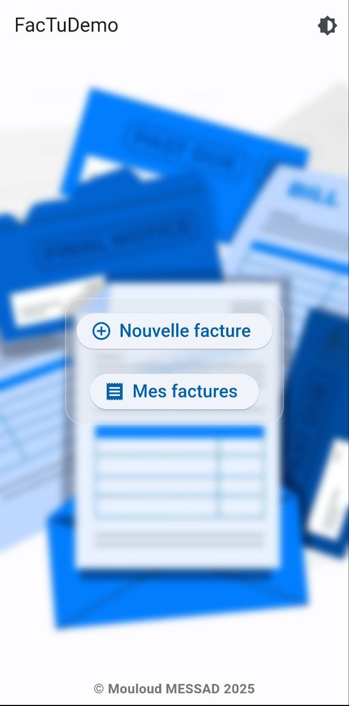
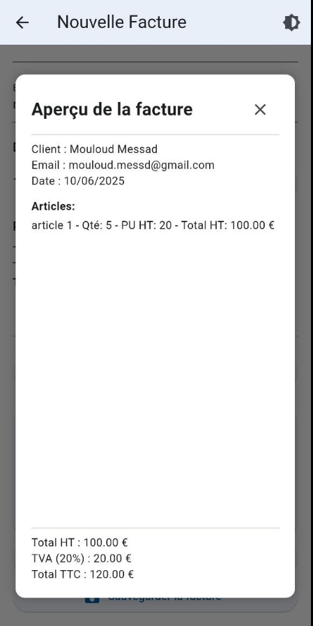
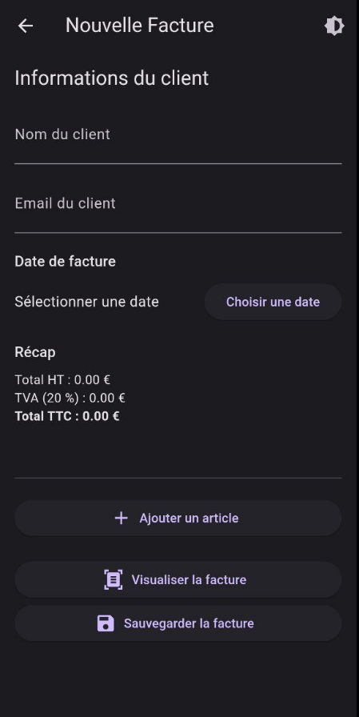
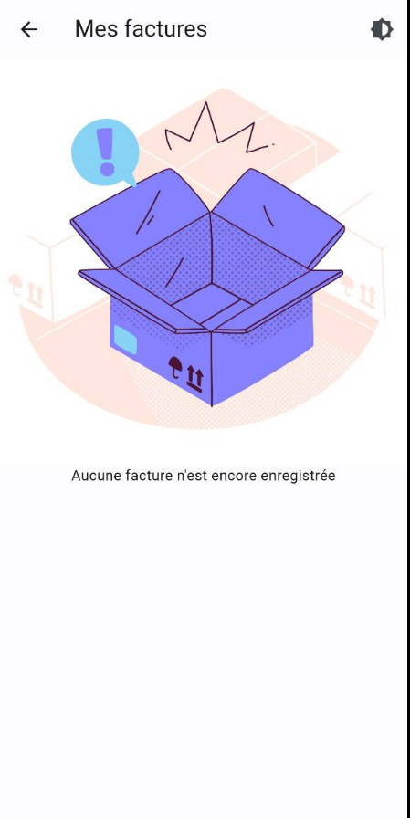
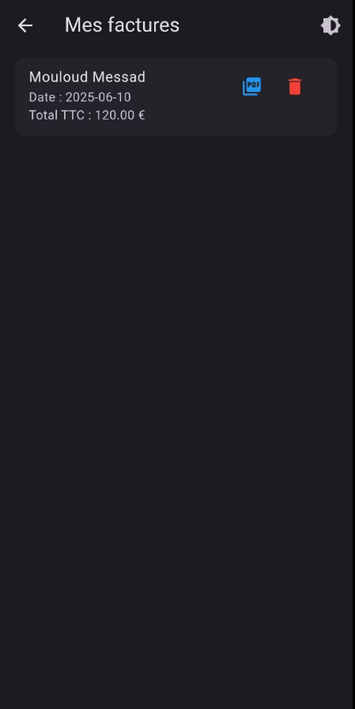
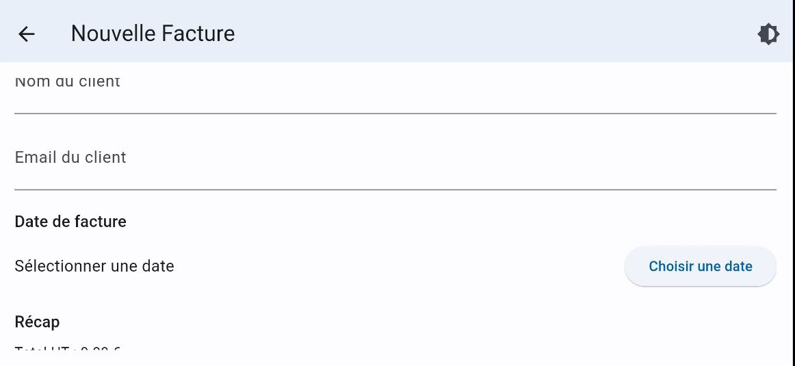

# Application Flutter : REEWAYFACTURE – FactuDemo

## Description

Cette application Flutter permet de créer, visualiser, sauvegarder et exporter des **factures personnalisées** sur mobile. L’utilisateur peut :

- Renseigner les informations du client
- Ajouter dynamiquement des articles à une facture
- Calculer automatiquement et dynamiquement, au moment de la saisie, le Total HT, la TVA et le Total TTC
- Visualiser un aperçu structuré de la facture
- Sauvegarder la facture localement (SQLite)
- Exporter la facture au format PDF
- Gérer les anciennes factures (consultation et suppression)
- Utiliser l'application en **mode clair ou sombre**

---

## Captures d’écran

|  |  |  |
| ---------------------------------------- | ---------------------------------------- | ---------------------------------------- |
|  |  |  |

---

## Choix techniques et explications

### Pourquoi SQLite ?

- Léger, rapide et persistant localement
- Ne dépend pas d'une connexion Internet
- Facile à utiliser avec le package `sqflite`
- Idéal pour une démonstration locale
- A nécessité l’utilisation de **Java 17**, car `sqflite` n’est pas encore totalement compatible avec **Gradle 8** et **Java 21**

### Utilisation des modules PDF avec `pdf` + `printing`

- Génération de factures hors ligne
- Possibilité d’imprimer directement ou de partager le fichier

---

## Fonctionnalités clés

- Création dynamique de factures
- Ajout et suppression d’articles
- Calculs automatiques (HT / TVA / TTC)
- Visualisation en temps réel
- Enregistrement local avec SQLite
- Exportation au format PDF
- Basculement clair/sombre via l’AppBar
