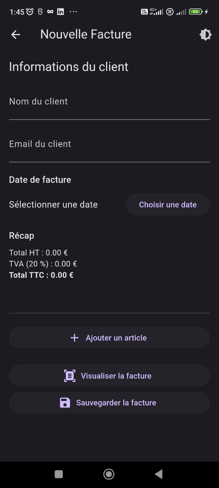
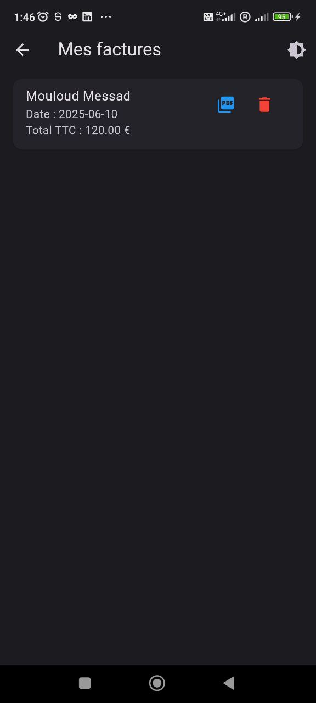
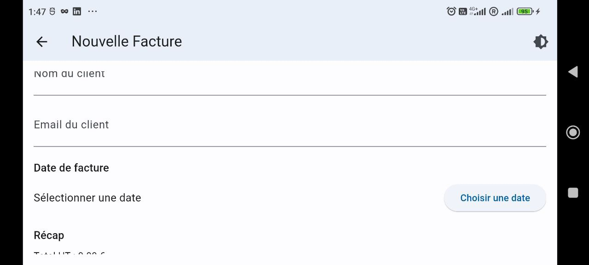

# Application Flutter : REEWAYFACTURE--FactuDemo

## Description

Cette application Flutter permet de créer, visualiser, sauvegarder et exporter des **factures personnalisées** sur mobile. L’utilisateur peut :

- Renseigner les informations client
- Ajouter dynamiquement des articles à une facture
- Calculer automatiquement et dynamiqueemnt au moment du renseigment des infos Total HT, TVA et Total TTC
- Visualiser un aperçu structuré de la facture
- Sauvegarder la facture localement (SQLite)
- Exporter la facture en PDF
- Gérer les anciennes factures (consultation & suppression)
- Utiliser l'application en **mode clair ou sombre**

---

## Captures d’écran

|  |  |  |
|  | 

---

## Choix techniques & explications

### Pourquoi SQLite ?

- Léger, rapide et persistant localement
- Ne dépend pas d’Internet
- Facile à utiliser avec `sqflite`
- ideal pour une demo
- impliquer la necesite de repasser en java 17 car sqlflite n'est pas 100% compatible avc gradle8 et java 21

### Utilisation des modules PDF avec `pdf` + `printing` ?

- Génération de facture hors-ligne
- Possibilité d’imprimer directement ou partager

### Pourquoi ValueNotifier pour le thème ?

- Simple pour un petit projet
- Suffit largement pour changer entre clair/sombre
- Pas besoin de dépendance externe

---

## Fonctionnalités clés

- Création dynamique de factures
- Ajout/suppression d’articles
- Calculs automatiques (HT / TVA / TTC)
- Visualisation en temps réel
- Enregistrement local
- Export PDF
- Thème clair/sombre toggle via AppBar
